# Todo App
This project has been created for the Octonius SDE Intern test by Yogesh Aggarwal.  NPM and Angular must be installed in the machine to run this project. To run the app, enter the following command in the command prompt. (Make sure you're in the ```todo_app/todo directory```). 
```
npm start
```
# Frontend
Here is the UI of the project made using Material design.

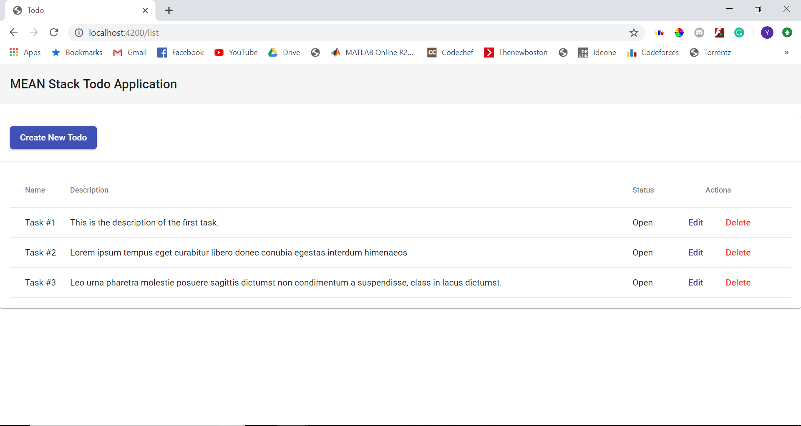

Let's add a todo. We click "Create New Todo".

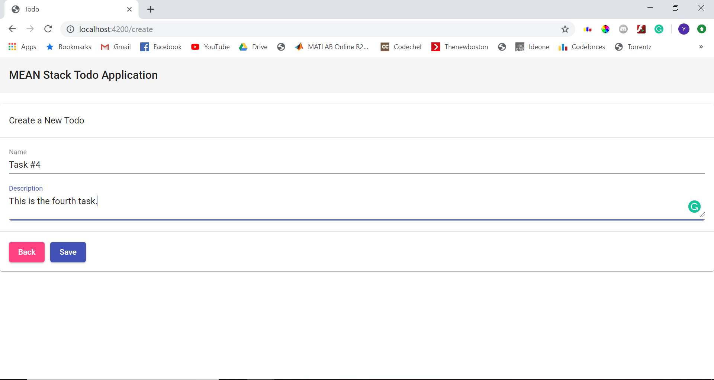

Here, we enter the name and description of the todo. The default status is set as "Open". We click save and are redirected to the homepage.

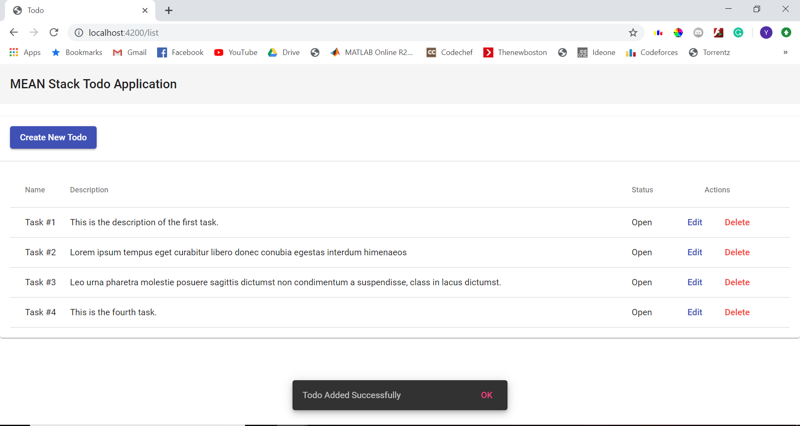

The todo has been successfully added! Now, let's try editing an existing todo. We click edit on task #4 and are redirected to the edit page.

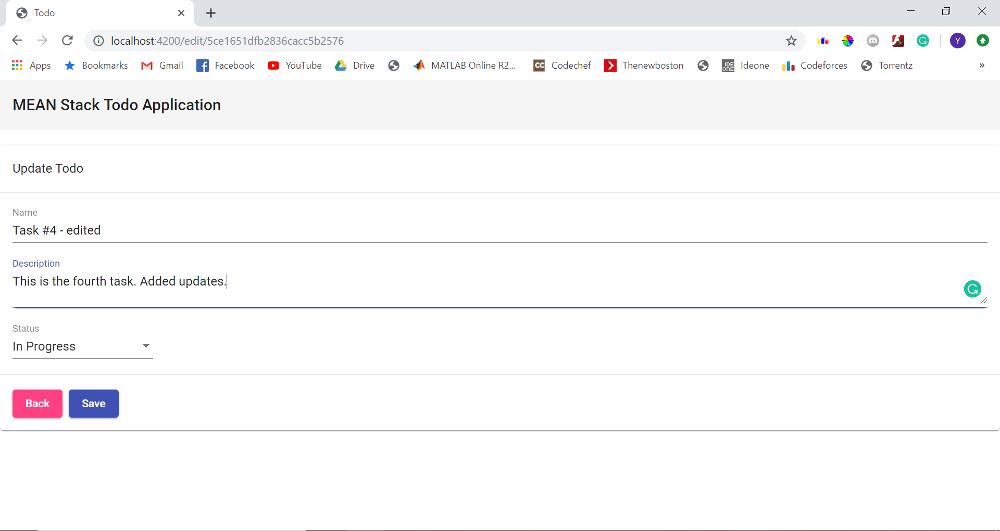

After making the edits, we click save and are redirected to the homepage. 

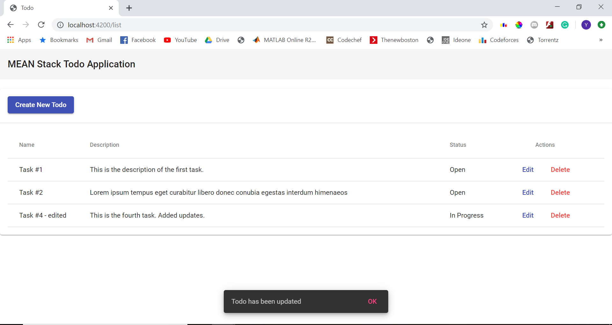

The todo has been edited! Now, let's delete a todo. We click delete on task #3

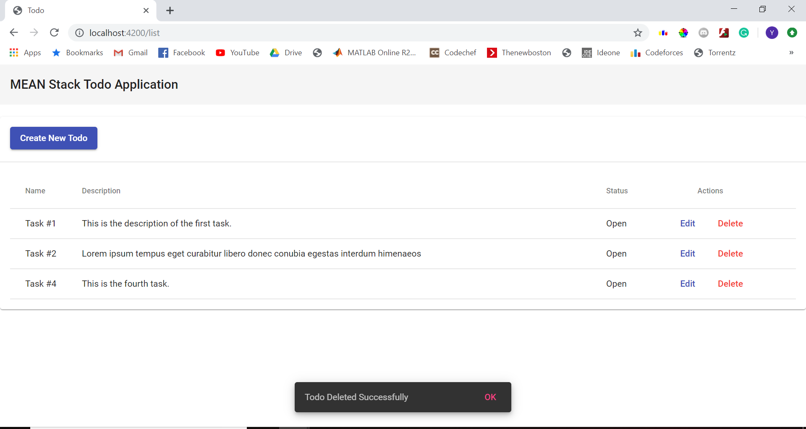

The todo has been deleted!


# Backend
The backend is written in node.js and the database used is a MongoDB cloud database created using mLab/mongoDBAtlas. Here are the screenshots of api requests made through postman. The server is running at localhost:4000/api/v1/

1. To fetch all todos

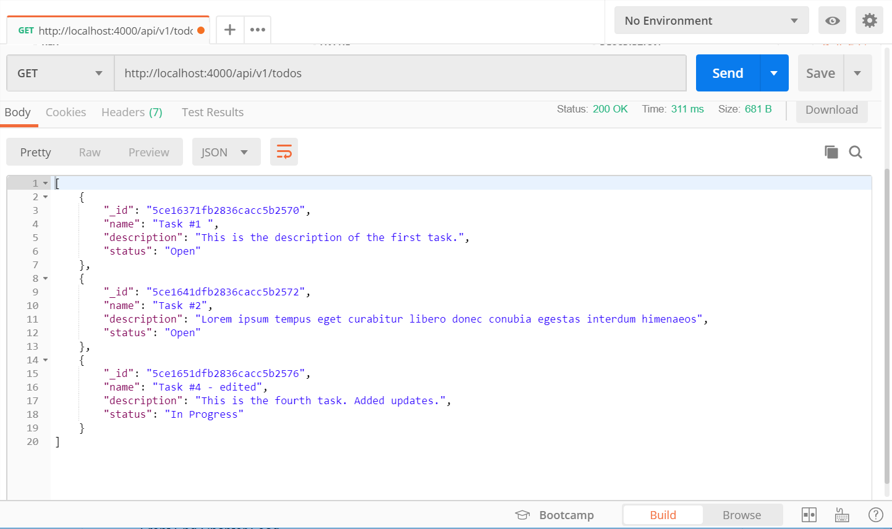

2. To fetch a single todo

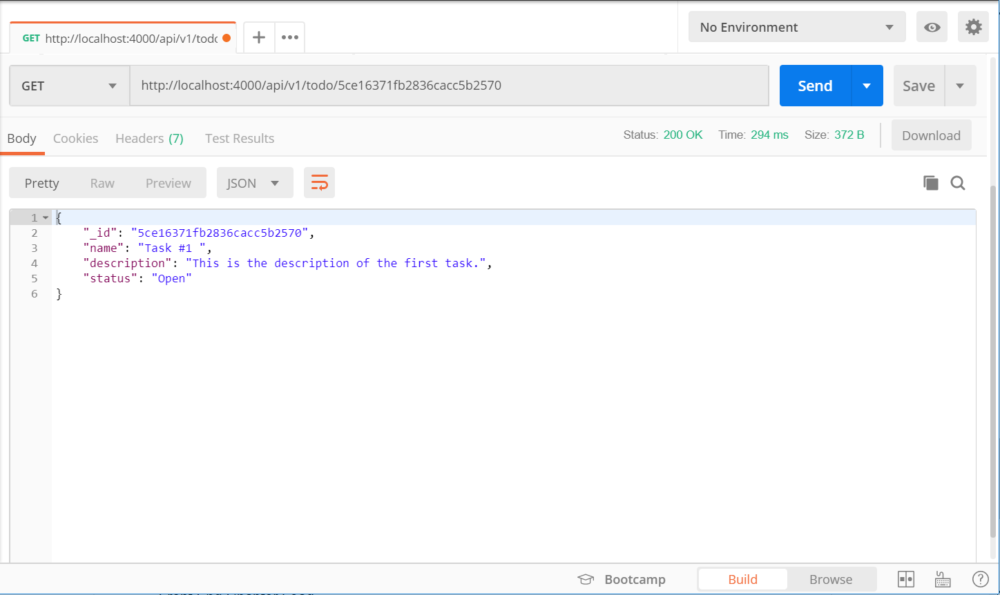

3. To add a new todo 

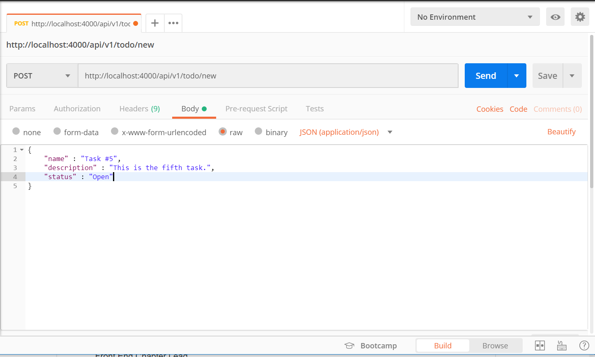

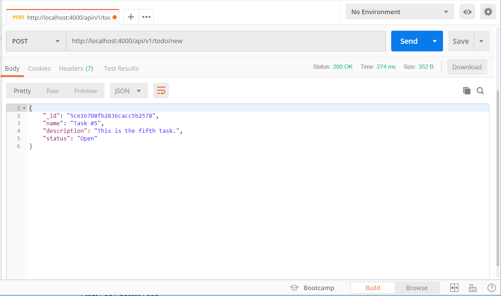

4. To update a todo

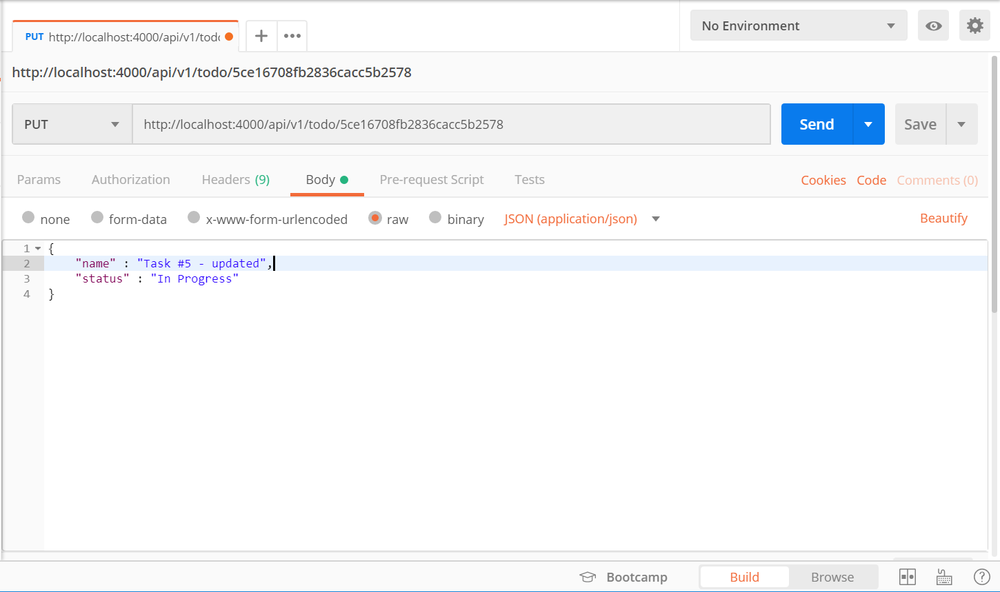

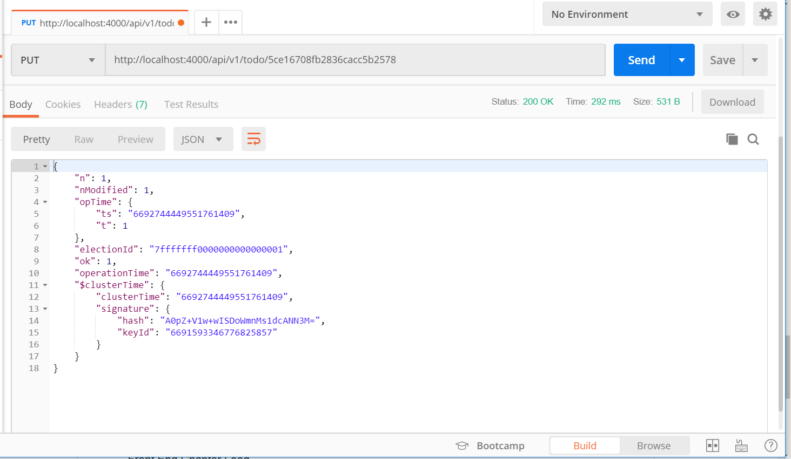

5. To delete a todo

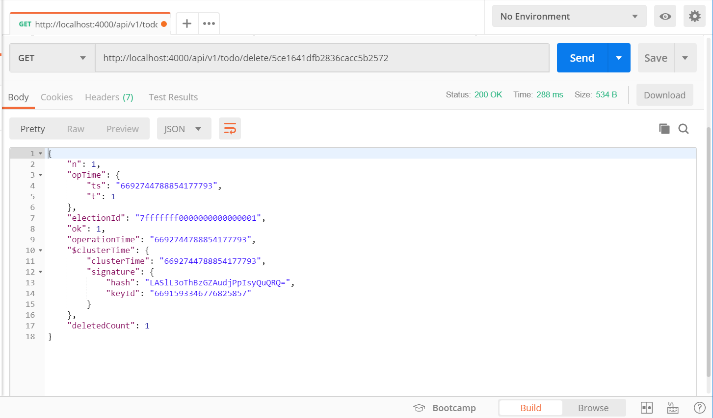


